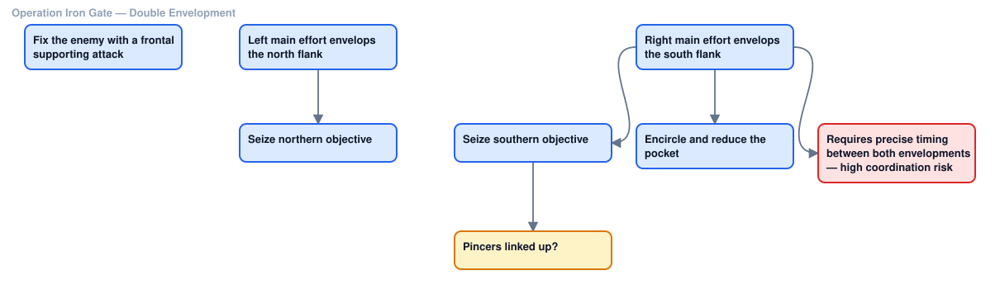
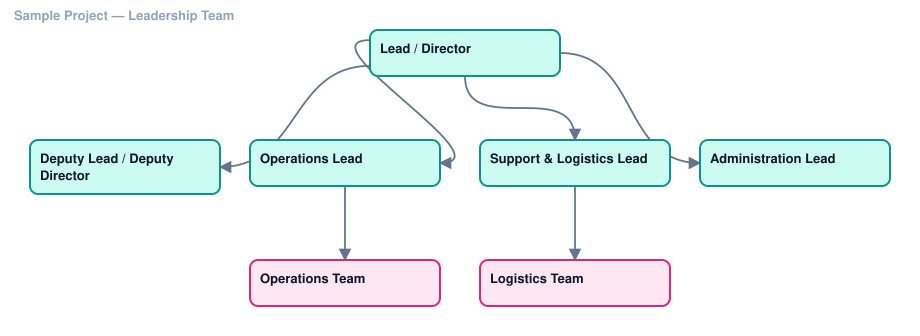
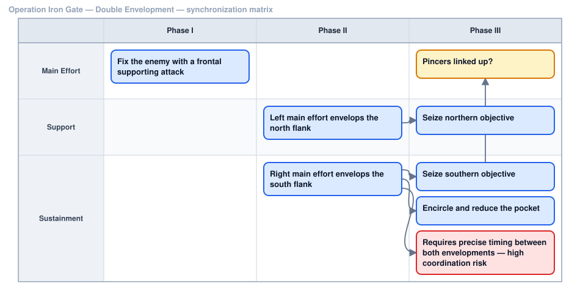

# COAX — Course Of Action eXplorer

**Coax a plan out of the mess.**

COAX is a single HTML file for sketching, comparing and briefing courses of
action. Open it in a browser and you get a drag-and-drop board for laying out
each COA, a synchronization matrix for putting those same steps against phases
and lanes, and a weighted decision matrix for choosing between them.

The same board also works for structures that aren't a plan at all — an org
chart, a leadership team, a project's reporting lines. Two of the eight box
types (Role, Group) and three of the templates exist for exactly that.

No install, no server, no account, no network. One file.




<sub>Sample plan — exported directly from the Chart view via COAX's own SVG export.</sub>

---

## Why it exists

Planning tools are either too heavy (a full project-management suite for three
boxes and an arrow) or too dumb (a drawing app that knows nothing about what a
COA is). COAX sits in between: it understands that you have **several** courses
of action, that each one has **pros and cons**, that the steps inside one need
to line up against **phases and lanes**, and that eventually somebody has to
**pick one**.

It also stays out of your business: **no cloud, no account, no telemetry, no
CDN**. Nothing leaves the machine. Drop it on a thumb drive and it works on an
air-gapped box.

## Getting it

Download `coax.html` and double-click it. That's the install.

## The three views

### Chart

A drag-and-drop board — org-chart / flowchart style.

- **Drag a swatch** from the palette onto the board to place a box of that
  type. Drop it on an existing box instead to retype that one
- **Double-click a box** to edit it. First line is the title, everything after
  is the body
- **Drag a side dot** onto another box to draw an arrow
- **Double-click an arrow** to label it (`if enemy withdraws`)
- **Tab** on a selected box creates a connected child and drops you into typing
- **Tidy** auto-arranges the whole thing into a clean tree

Eight box types, distinguished by colour: Action, Decision, Objective,
Branch/Sequel, Risk, Note for planning a course of action — plus **Role /
Person** and **Group / Team** for org charts and leadership structures, where
a box is a seat or a department rather than a step. Clicking a swatch sets the
type of whatever is selected, and the type `Tab` gives new children; dragging
one places a box instead.



### Swim lanes

The *same boxes*, re-laid-out as a synchronization matrix: phases across the
top, lanes down the side. Build the flow once in Chart, then flip here to see
it against time and responsibility.



- **Drag a box into a cell** to set its phase and lane. Where you drop it
  inside the cell sets its order
- **Drag a swatch** straight into a cell to create a box already assigned
  there; the target cell highlights as you drag over it
- **Tab** creates the next step in the *next phase, same lane*
- Unassigned boxes collect in an Unassigned row/column that only appears when
  something needs it — nothing ever goes missing
- Phases and lanes are renamed inline, reordered with `‹ ›`, deleted with `×`.
  Deleting a phase never deletes its boxes

### Compare

A weighted decision matrix. Criteria as rows, COAs as columns, weights you set,
scores 1–5, totals computed, best highlighted. Underneath, every COA's concept,
pros, cons, assumptions and risks side by side.

## Templates

**Templates** opens a library of common shapes — click one and it lands as a
new COA, already laid out, with a concept pre-filled in the notes panel. Under
**Start here**: a blank single box, and a generic decision-branch skeleton.
Under **Offense**: Frontal Attack, Single and Double Envelopment, Turning
Movement, Infiltration, Penetration. Under **Defense**: Area Defense, Mobile
Defense, Economy of Force. Under **Organization**: Basic Org Chart, Leadership
Team, Project Team — built from Role and Group boxes rather than maneuver
steps, for a reporting structure instead of a plan.

Each template is built from a step outline internally — the same syntax and
pipeline as Paste outline — so it inherits the same parsing rules (`?` for a
decision, `!` for a risk, and so on). Adjust it afterward like any other COA;
nothing about a template box is special once it's placed.

Reachable from the header, or right-click empty board / empty rail space.

## Starting from an outline

Planning usually starts as a list in a document or an email, and retyping it as
boxes is the tedious part. **Paste outline** turns text straight into a laid-out
chart — indentation becomes hierarchy, and the arrows are drawn for you.

```
# COA 1 — Direct
Cross LD at H-hour :: SP NLT 0500
  Seize OBJ FALCON
    Consolidate on OBJ?
  Screen east flank
  ! Flank exposed to counterattack

# COA 2 — Envelopment
1. Feint on axis BLUE
   a) Main effort north
```

| Written as | Means |
| --- | --- |
| indentation | a child box, with the arrow drawn |
| blank line | start a new chain back at the top |
| `# Name` | start a new COA |
| a line ending in `?` | a Decision box |
| `!` prefix | a Risk box |
| `%` prefix | a Role / Person box |
| `&` prefix | a Group / Team box |
| `title :: body` | split into the box's title and body text |
| `@unit` at line end | assign the unit or owner |

List markers you paste in — `-`, `*`, `1.`, `a)`, `(2)` — are stripped
automatically, so an outline copied out of a document usually just works.

Three modes: **add to this COA**, **replace this COA**, or **create new COAs**
(one per `#` heading). The footer tells you what you're about to get —
`7 boxes · 5 arrows → 2 new COAs` — before you commit, and the whole import is
a single undo.

Inside the box: `Tab` indents, `Ctrl+Enter` applies, `Esc` cancels.

## Right-click

The context menu changes with what is under the pointer.

**On a box** — edit its text, add a child, duplicate it, change its type from a
row of swatches, or delete it. Right-clicking a box that isn't selected selects
it first; with several selected the menu says so (`Delete 3 boxes`) and acts on
all of them. With two or more selected (in Chart view) you also get **Align**
— left / center / right, top / middle / bottom — and, with three or more,
**Distribute horizontally / vertically** to space them evenly.

**On an arrow** — label it, **reverse its direction**, or delete it.

**On empty board** — place a new box of any type *at the point you clicked*,
open the paste dialog, select all, tidy, or fit to window.

**On a COA in the left rail** — rename, duplicate, move it up or down the
list, add a new one, or delete it. Right-clicking empty rail space offers new,
duplicate current, and paste outline.

Every item shows its keyboard equivalent where it has one, and menu and
shortcut run the same code, so neither can drift from the other.

## Keeping it tidy

**Tidy** rebuilds the whole chart as a tree from scratch. For smaller touch-ups
— a rough layout from pasting an outline, or boxes dropped from the palette —
two lighter tools:

- **Align / Distribute**, above, from the right-click menu on a multi-box
  selection.
- **Live alignment guides.** Drag a box near another box's edge or center and
  a dashed guide line appears the moment they line up, snapping the box to it
  exactly. Works on any selection size, checks both axes independently, and
  only engages within a few screen pixels — it won't fight you across the
  board.

## Multiple arrows from one box

Drag more than one connection off the same side of a box and they fan out
across it automatically, ordered by where each one is headed, rather than
piling up on the exact same point. A side with only one connection is
unaffected — same center point as always.

## Who does what

Every box can carry a **unit / task** — a unit, an asset, an owner, whoever is
responsible. Select a box and the inspector appears along the bottom of the
canvas; type into **Unit / task** and it shows on the box under a thin rule. In
the swim view the same inspector also carries the box's phase and lane.

Units are free text with autocomplete drawn from every unit already used in the
project, so you get consistency without maintaining a roster. Pasted outlines
can set them directly with a trailing `@unit`.

The **unit filter** in the toolbar fades everything not assigned to the unit you
pick, rather than hiding it — the shape of the plan stays readable while you
follow one unit through it. The filter is a screen aid only: PNG, SVG and the
brief always render every box at full strength, so nothing ever prints
half-faded.

The brief's **Task org** table turns all of this into the "who does what" page —
every unit, its tasks, and the phase and lane each falls in, with a count of any
boxes still unassigned.

## Building several COAs

The left rail holds your COAs. The fast path is **Duplicate current** — build
COA 2 from COA 1 and change two boxes. Node, arrow, phase and lane identities
are all remapped, so the copy is genuinely independent, and it lands directly
below its original rather than at the end of the list.

Right-click a COA to reorder it with **Move up** / **Move down**. Rail order is
also the column order in the comparison matrix, so this is worth having when
you want the COAs presented in a particular sequence.

## Saving

COAX autosaves to the browser continuously. That's convenience, not storage —
the durable copy is the file.

- **Save file** writes a `.coax.json` you can keep, version or email
- **Open file** loads one back
- **PNG** / **SVG** export whichever view is showing
- **Brief** assembles the whole printable document — see below

Because autosave is keyed to how the file is opened, moving `coax.html` to
another folder or machine can leave the autosave behind. Use **Save file** to
carry work across.

## Dark mode

COAX follows your system's light/dark setting by default. The button at the
right of the header (labeled **Auto**, **Light** or **Dark**) cycles through a
manual override if you want the app to ignore the system setting; your choice
is remembered for next time.

Exports are the one thing dark mode doesn't touch — PNG, SVG and the brief
always render light, like paper, regardless of which theme the app itself is
showing.

## The brief

**Brief** assembles everything into one printable document and shows it as a
paper-sized preview, so what you see is what prints. Per COA: the name, the
concept, the chart, the synchronization matrix, the task organization, and
pros / cons / assumptions / risks. Then a final page with the comparison
matrix, the weighted totals, and which COA scored highest.

Checkboxes across the top control what goes in — all COAs or just the current
one, chart, sync matrix, task org, notes, comparison — plus portrait or
landscape. The preview re-renders as you toggle. **Print / Save PDF** sends it
to the browser's print dialog, where "Save as PDF" gives you the file.

Sections that have nothing in them are left out rather than printed empty, so a
COA you haven't written notes for doesn't produce a page of blank headings.

## Publish

**Publish…** exports the active COA as a separate, self-contained HTML file —
a single chart plus its notes, styled as its own document rather than a copy
of the full COAX editor. It's ready to become a shareable, co-editable link:
hand the file to a Claude Code session and ask it to publish it as a Claude
Artifact. Anyone with the link can then open it, drag boxes, edit the notes,
and save a new version — no file to pass around, and no COAX install needed
on their end.

It's a one-way export: editing the published page never changes anything back
in `coax.html`, and republishing overwrites whatever the page held before, so
treat the exported file as a snapshot of one COA at the moment you exported
it, not a synced copy.

## Keyboard

| Key | Does |
| --- | --- |
| `Tab` | New child box, connected, ready to type |
| `Enter` | Edit the selected box |
| `Ctrl+D` | Duplicate selection |
| `Ctrl+A` | Select all boxes |
| `Delete` | Delete selection |
| `Ctrl+Z` / `Ctrl+Y` | Undo / redo |
| `Esc` | Deselect, or cancel an edit |
| Wheel | Zoom · drag empty board to pan |

## License

MIT — see [LICENSE](LICENSE).
